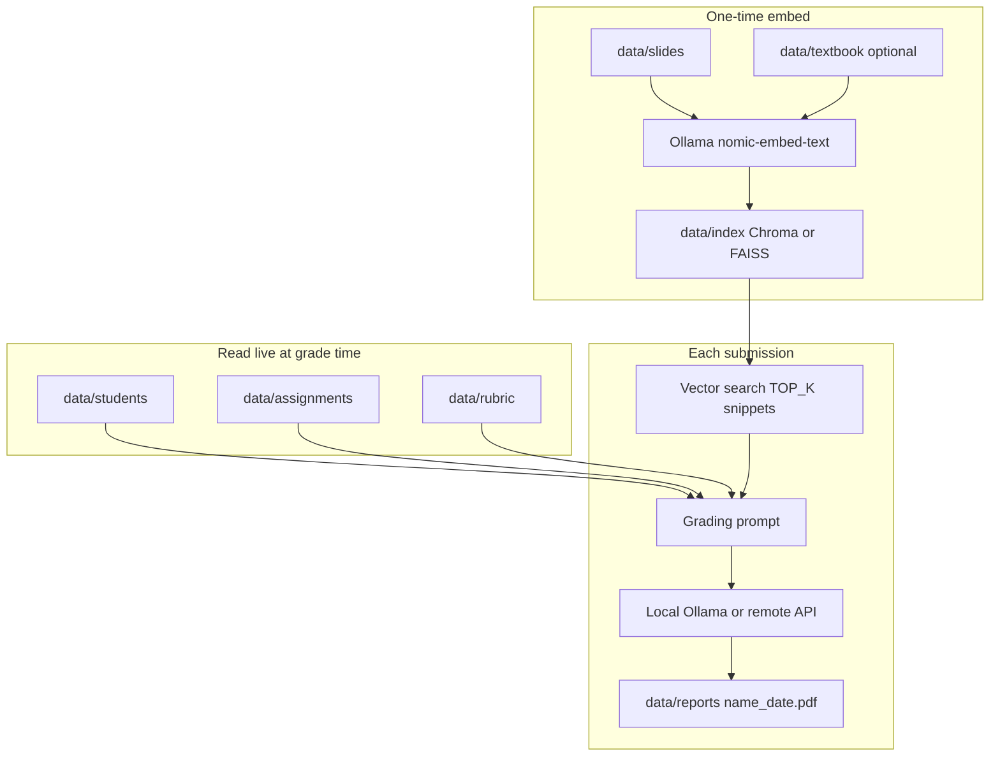

# Flexavior Educator Assessment Automation

Lightweight, portable grading service for a Online Learning course. Student reports go into `data/students/`. Assignment questions and the rubric are read live. Course slides (and optionally the textbook) are embedded once for vector search. An LLM scores each submission and writes a PDF to `data/reports/{student_name}_{YYYYMMDD_HHMMSS}.pdf`.

---

## Architecture (KISS / SOLID)

| Module | Responsibility |
|---|---|
| [`app/submission.py`](app/submission.py) | Extract student DOCX/PDF text (never LlamaIndex reader) |
| [`app/briefs.py`](app/briefs.py) | Live-load assignment, rubric, policy |
| [`app/rag.py`](app/rag.py) | Chroma index + slides-first / textbook-detail retrieval |
| [`app/prompts.py`](app/prompts.py) | Semantic topic-matching grading prompt |
| [`app/grading_service.py`](app/grading_service.py) | Orchestrate assess workflow |
| [`app/main.py`](app/main.py) | HTTP API only |
| [`data/grading_policy.txt`](data/grading_policy.txt) | How to match student sections to assignment topics |

**Security:** API keys in `.env` only (never commit — see `.gitignore`); upload filenames sanitized; reports served from `data/reports/` with path traversal check; destructive archive/remove actions require an in-app confirmation modal.

**Cost / performance:** Remote LLM for grading; local Ollama only for embeddings; Chroma avoids 16GB JSON reload; background index load.

---

## Summary

| Item | Behaviour |
|---|---|
| **What it does** | Grades a student report against the current assignment + rubric, using course slides as factual baseline |
| **Scoring** | Dynamic. Change files in `data/assignments/` or `data/rubric/` — no index rebuild |
| **Course knowledge** | One-time vector index of slides (recommended) and/or textbook |
| **Grading LLM** | Switchable: local Ollama or remote OpenAI-compatible APIs (OpenRouter, OmniRoute, Gemini, Groq, …) |
| **Embeddings** | Always local Ollama (`nomic-embed-text`) — independent of the grading model |
| **UI** | Simple page at `http://localhost:8000` — upload, pick provider/model, download PDF |
| **Portable** | Python FastAPI app + folders under `data/`. No database server required for grading |

**Scoring authority vs retrieval:** marks come from the **rubric**. What was asked comes from **assignments**. How to use slides vs textbook is in [`data/grading_policy.txt`](data/grading_policy.txt) (live-read, like the rubric — not extra marks). Do not put retrieval rules inside the student-facing rubric unless you want them visible as marking criteria.

---

## How it works



### Request path

1. **Startup** — `run.py` starts FastAPI. `initialize_index()` loads `data/index/` if it exists, otherwise embeds slides/textbook once.
2. **Upload** — `POST /upload/` saves the file to `data/students/`.
3. **Grade** — `POST /grade/` with `{ filename, provider, model }`:
   - Loads assignment TXT and rubric DOCX/TXT as full strings (milliseconds).
   - Embeds a short slice of the student text with Ollama, retrieves the closest course snippets.
   - Sends assignment + rubric + snippets + student text to the selected LLM.
   - Writes `data/reports/{StudentName}_{YYYYMMDD_HHMMSS}.pdf`.
4. **Download** — `GET /reports/{filename}`.

Batch: `POST /run-batch-grading/?provider=openrouter&model=google/gemini-2.5-flash` grades every file in `data/students/`.

---

## Folder layout

```
Grading-system-Dev/
├── app/                 # FastAPI + grader + RAG + PDF
├── static/              # Upload page (HTML/CSS/JS)
├── data/
│   ├── assignments/     # Live: official questions (prefer .txt)
│   ├── rubric/          # Live: marking scheme
│   ├── slides/          # Indexed: course slides (recommended for RAG)
│   ├── textbook/        # Optional index: full book PDF is large
│   ├── students/        # Input submissions
│   ├── reports/         # Output PDFs
│   └── index/           # Persisted vector store (do not edit by hand)
├── .env                 # Keys, default provider, embed model
├── requirements.txt
└── run.py
```

---

## Prerequisites

- **Python 3.10+** and the project venv (`grading-system-dev` or `.venv`)
- **Ollama** running at `http://localhost:11434` with:
  - `nomic-embed-text` (required for index build and search)
  - `qwen3.5:9b` if you grade locally (fits ~6GB GPU)
- Course files in place: assignment, rubric, slides; at least one student file to test
- For **remote grading**: an API key in `.env` (OpenRouter, OpenAI, Gemini, Groq, …)
- For **OmniRoute**: desktop gateway at `http://localhost:20128/v1` (provider keys live in OmniRoute, not in this app)

Install and start:

```powershell
cd Grading-system-Dev
python -m venv .venv
.\.venv\Scripts\pip.exe install -r requirements.txt
copy .env.example .env
.\.venv\Scripts\python.exe run.py
```

Open `http://localhost:8000`. With an empty `data/app.db`, the app opens **`/setup`** so you create the supervisor email/password. Student accounts, submissions, and reports start empty — upload course files (slides, textbook, rubric) and create users from the portal.

Unit tests under `tests/` are included in the repo (`pytest`). Runtime folders `data/students/`, `data/reports/`, and `data/index/` are gitignored and stay empty on clone.
---

## Embedding (vector search)

Embeddings are **only** for course material search. They are not the scoring model.

| Setting | Value |
|---|---|
| Model | `EMBED_MODEL=nomic-embed-text` (Ollama) |
| Indexed dirs | `data/slides/` (preferred) and `data/textbook/` |
| Not indexed | Assignment, rubric, student files |
| Persist path | `data/index/` |
| Query | Student snippet → similar slide/textbook chunks → `TOP_K=3` snippets in the prompt |

**Assignment and rubric stay as live text** so scoring follows whatever files are on disk right now.

Rebuild after changing slides/textbook or embed model: delete `data/index/` and restart. Wait until “Indexing Complete” (first build) or a fast Chroma/FAISS load (later starts).

---

## Provider switching (local vs remote)

No code change. `.env` holds keys; the assessment page picks provider and model **per grade request**. After editing `.env`, **refresh the browser** — no need to restart Python for provider/key changes.

`LLM_PROVIDER` is still used: it sets the **default** dropdown and is used when `/grade/` omits `provider`.

| Provider | `.env` | Typical model |
|---|---|---|
| Local Ollama | `LLM_PROVIDER=ollama` + `LLM_MODEL` | `qwen3.5:9b` |
| OpenRouter | `OPENROUTER_API_KEY` + `OPENROUTER_MODEL` | `google/gemini-2.5-flash`, Claude, Grok |
| OpenAI | `OPENAI_API_KEY` + `OPENAI_MODEL` | `gpt-4o-mini` |
| Gemini | `GEMINI_API_KEY` + `GEMINI_MODEL` | `gemini-2.5-flash` |
| Groq | `GROQ_API_KEY` + `GROQ_MODEL` | `llama-3.3-70b-versatile` |
| OmniRoute gateway | `OMNIROUTER_BASE_URL=http://localhost:20128/v1` | `auto` or a routed model id |
| Anthropic / DeepSeek | matching `*_API_KEY` / `*_MODEL` | see `.env.example` |

Commented (`#`) keys do **not** appear in the dropdown. Uncomment a block, refresh the page.

Local vs remote:

- **Embeddings** always go to local Ollama.
- **Grading** goes to the selected provider. On a 6GB GPU, prefer a cloud/OpenRouter model for scoring and keep Ollama for `nomic-embed-text` only.
- `gemma3:27b` on 6GB VRAM is RAM-offloaded and slow; use as a quality pass, not the default.

---

## Key facts

- Scoring is **dynamic**. Vector rebuild is **not** required when assignment or rubric change.
- PDF name: `{student_name}_{YYYYMMDD_HHMMSS}.pdf` (generation timestamp; submission date shown inside the PDF only when found in the document).
- Student submissions are extracted in full. Long text is graded in multiple passes (`MAX_CHARS_PER_ANSWER` per LLM call, default 12000). If extracted text exceeds `MAX_SUBMISSION_CHARS` (default 500000), grading fails with an explicit error instead of silently truncating.
- If the LLM does not return JSON, the PDF still generates a **manual review** page with raw output.
- Hardware note: 6GB GPU + 32GB RAM — local 9B models are workable; 27B is optional/slow.
- JSON vector files are retired. Course search uses **Chroma** at `data/index/chroma/` (slides by default). Restarts open the HTTP page immediately; the index loads in the background in seconds after the first build.

---

## Dependencies

From `requirements.txt`:

| Package | Role |
|---|---|
| `fastapi`, `uvicorn`, `python-multipart` | HTTP server and file upload |
| `python-dotenv` | `.env` load (re-read for provider list) |
| `openai` | OpenAI-compatible grading clients |
| `llama-index`, `llama-index-embeddings-ollama`, `llama-index-llms-ollama` | RAG + local embed/LLM |
| `chromadb`, `faiss-cpu` | Fast on-disk vector index (use instead of JSON) |
| `python-docx`, `pdfplumber`, `python-pptx` | Assignment, rubric, student, slides parsing |
| `reportlab` | PDF reports |
| `pydantic`, `requests`, `tqdm`, `numpy` | Config, HTTP, progress, arrays |

---

## Optimized performance: Chroma + slides

**Now implemented.** The old LlamaIndex JSON store (`default__vector_store.json`) is removed on startup if present.

| Setting | Default |
|---|---|
| Storage | Chroma at `data/index/chroma/` (collections `slides` and `textbook`) |
| Sources | Both `data/slides/` and `data/textbook/` (`INDEX_INCLUDE_TEXTBOOK=true`) |
| Retrieval | Slides first (`SLIDES_TOP_K=3`), then textbook detail (`TEXTBOOK_TOP_K=2`) |
| Policy file | `data/grading_policy.txt` — live-read before scoring |
| Chunk size | 800 characters, overlap 80 |
| Server start | Immediate — index builds/loads on a background thread |

First Chroma build embeds slides, then the textbook (longer). Later restarts open Chroma in seconds.

Do **not** delete `data/index/` without confirmation. Archive to `data/archive/` if a rebuild is required.

Live assignment/rubric/policy reads add milliseconds. Scoring time is the LLM call plus Ollama embeds for search.

---

## Roles and UI

First visit with an empty user table opens `/setup` to create the supervisor. After that, `/login` is required.

| Role | Pages |
|---|---|
| Supervisor | Dashboard, Assess, Jobs, Files, Review, Accounts, Settings (deadline, slides, textbook) |
| Educator | Dashboard, Assess (existing upload/grade), Jobs, Files (zip), Review |
| Student | Submit before deadline, view own published PDF; self-grade only with special permission |

SQLite metadata lives in `data/app.db`. Passwords are bcrypt-hashed. Course file removal **archives** to `data/archive/<timestamp>/` then rebuilds that Chroma layer. Each PDF gets a SHA-256 sidecar (`.pdf.sha256`) recorded in the reports table.

**MySQL:** The app uses SQLite by default. You can migrate to MySQL by exporting schema/data (e.g. `sqlite3 data/app.db .dump`, or tools like [sqlite3-to-mysql](https://github.com/techouse/sqlite3-to-mysql)) and pointing the app at a MySQL driver — there is no built-in one-click import; table definitions would need a MySQL-compatible adapter if you replace `app/db.py`.

**Word count:** Reports show extracted word count vs rubric limits (default 1200–1500, max 2000). Over-limit counts appear in warning color on the PDF and review page.

**Supervisor removal:** On **Files**, supervisors can **Remove** duplicate/mismatched submissions or reports. Files move to `data/archive/`; reasons are stored in the `deletion_log` table (view via `GET /api/deletion-log`).

---

## API

| Method | Path | Purpose |
|---|---|---|
| `GET` | `/` | Redirects to setup, login, dashboard, or student home |
| `GET` | `/assess` | Educator upload + grade (existing flow) |
| `GET` | `/api/index-status` | Chroma index ready / building |
| `POST` | `/upload/` | Save file to `data/students/` (staff) |
| `POST` | `/grade/` | Grade one file (`filename`, optional `provider`, `model`) |
| `POST` | `/run-batch-grading/` | Grade all student files |
| `GET` | `/api/jobs` | Paginated jobs (`limit`, `offset`, `status`) |
| `GET` | `/api/dashboard` | Counts + last 10 reports |
| `POST` | `/api/zip` | Zip selected students or reports files |
| `GET` | `/reports/{filename}` | Download PDF (students: own published only) |

---

## Test checklist

- [ ] Ollama up; `ollama list` shows `nomic-embed-text`
- [ ] `.env` has `LLM_PROVIDER` and at least one usable provider
- [ ] Assignment TXT and rubric present
- [ ] Slides in `data/slides/` (textbook optional)
- [ ] Index built or loaded without falling back to “assignment + rubric only”
- [ ] `AnthonyMin_FinalAssignment.docx` (or another file) in `data/students/`
- [ ] Grade from the page; PDF appears as `{name}_{date}.pdf` with score, coverage, criteria

##Start
.\.venv\Scripts\python run.py
http://127.0.0.1:8000
